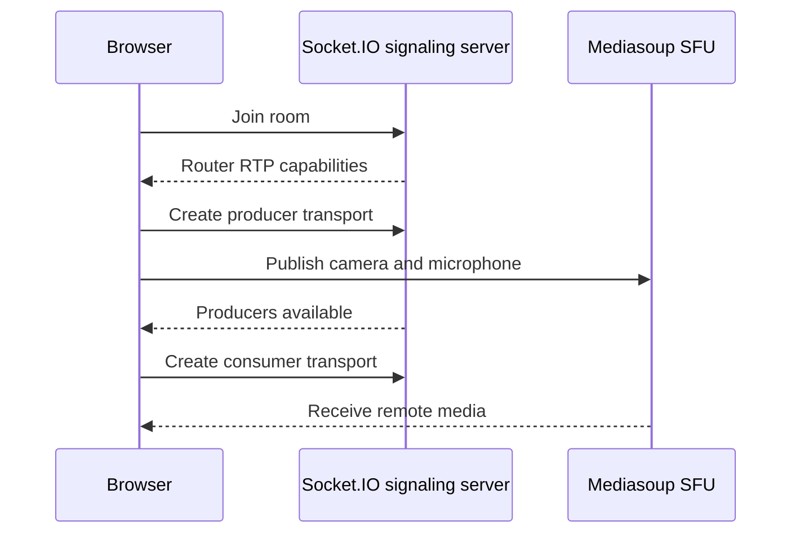

# Mediasoup Meeting Client

<div align="center">


A Next.js meeting-room client for a Mediasoup-based selective forwarding unit (SFU).

</div>



## Features

- Join a named meeting room.
- Publish microphone and camera tracks through a Mediasoup producer transport.
- Consume remote audio/video through consumer transports.
- Track active speakers and newly available producers over Socket.IO.
- Mute/unmute local audio and render participant feeds.

## Setup

```bash
npm install
```

Create `.env.local`:

```dotenv
NEXT_PUBLIC_SOCKET_URL=http://localhost:3000
```

Point the value at a compatible signaling server that implements the Socket.IO events used in `lib/mediasoup/`.

## Run

```bash
npm run dev
```

Open [http://localhost:3000](http://localhost:3000), enter a name and room, and allow camera/microphone access.

## Scope

This repository is the browser client only. It requires a separate Mediasoup worker/signaling backend and secure HTTPS/WSS deployment for production use.
